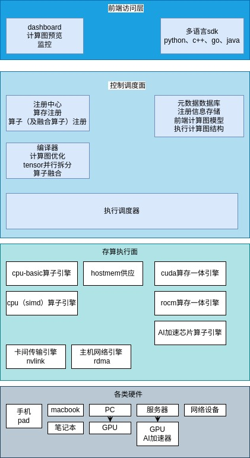

# deepx

deepx提出了一种超大规模自动分布式训推一体化的开放计算调度框架。

+ 该框架前端实现了支持多语言 SDK 调用；
+ 调度面通过注册中心、元数据数据库、计算图编译器优化器和执行调度器等组件，实现高效的任务调度与管理；
+ 执行面完成算存、算子引擎和网络通信的注册。

通过严格遵循存算控分离的思想，框架能够在超大规模场景下实现自动分布式训练与推理的一体化，有效应对掉卡、掉节点等异常情况，提高计算资源的利用率和系统的可靠性。

通过开放式计算调度框架，可供不同背景的厂家、开发者，按统一协议，适配和开发自己的算子引擎、算存引擎、网络引擎等。

## 一、引言

随着深度学习技术的快速发展，模型的规模和复杂度不断增加，对计算资源的需求也呈指数级增长。在超大规模的深度学习训练和推理任务中，分布式计算成为解决计算瓶颈的关键技术。然而，现有的分布式深度学习框架在应对大规模计算时，仍然面临着高可用计算保障不足、训推一体化程度低、多语言支持不完善等问题。

deepx旨在设计一种超大规模自动分布式并行训推一体化的深度学习框架，以解决上述问题。

开放式计算调度框架，可以让更多厂家、开发者参与进来，按统一接口标准，适配和开发自己的算子引擎、算存引擎、网络引擎等，整体加速AI的能力。

## 二、架构 

### 存算控分离思想

存算控分离是一种架构设计思想,将存储、计算和控制三个层面进行解耦,以提高系统的灵活性、可扩展性和可维护性。在本框架中:

### 1. 存储分离
- 将数据存储与计算分离,数据可以存储在显存、内存、高性能nvme、分布式文件、对象存储等系统
- 存储高可用。对单次计算任务、单卡、单节点等故障，进行最小成本、最快恢复。

### 2. 计算分离  
- 计算节点可以独立扩展,支持异构计算资源(CPU/GPU/NPU等)
- 算子引擎可插拔,支持不同的加速硬件(GPU/NPU/DSA/DSP/CPU等)
- 计算任务可以灵活调度到不同节点

### 3. 控制分离
- 调度控制与具体执行分离
- 通过注册中心实现资源的统一管理
- 支持故障恢复和负载均衡
- 提供统一的任务调度和监控接口

存算控分离的优势:
- 提高系统的可扩展性,各个组件可以独立演进
- 增强系统的容错能力,单个组件故障不会影响整体
- 便于系统维护和升级,可以分别对各个层面进行优化
- 支持更灵活的部署方式,适应不同的应用场景

劣势
- 计算与存储分离，需要额外进行数据传输，增加通信成本

解决方案

存算一体控分离思想

相比存算控分离，存算一体控分离，在计算与存储分离的基础上，增加了计算与存储的融合，减少了计算与存储的通信成本。

- 使用分级缓存。通过AI芯片的分级高速缓存，减少芯片的数据读写时间
- 支持存算一体的GPU、AI加速卡等，减少数据传输

## 三、框架前端设计
 
### 2.1多语言 SDK 支持

框架前端支持多语言（C/C++, Python, Go, Java, Lua, JavaScript）的 SDK 调用，以方便不同背景的开发者使用。每种语言的 SDK 都提供了统一的接口，用于描述数据与计算流。开发者可以根据自己的需求选择合适的语言进行开发，提高开发效率。

### 2.2 dashboard监控可视化
dashboard可对任务、节点、卡、算子、网络、存储、计算图等进行监控，可视化展示。

## 三、调度面设计

### 3.1 注册中心

注册中心是调度面的核心组件之一，支持内存注册、算子注册、网络注册。内存注册记录了各个计算节点的内存资源使用情况，算子注册存储了框架中可用的算子信息，网络注册则记录了节点之间的网络连接信息。通过注册中心，调度器可以实时获取系统的资源状态，为任务调度提供依据。

### 3.2 元数据数据库

元数据数据库中心存储该框架的一切元信息，包括模型结构、数据分布、任务配置等。这些元信息为计算图编译器优化器和执行调度器提供了必要的信息，帮助它们做出更合理的决策。

### 3.3 计算图编译器优化器

计算图编译器优化器根据注册的内存、算子的上限与性能，自动拆分 tensor，生成详细执行图。在超大规模的深度学习任务中，tensor 的规模往往非常大，直接进行计算会导致内存不足和计算效率低下。计算图编译器优化器通过对 tensor 进行拆分，将大任务分解为多个小任务，提高内存利用率和计算效率。

### 3.4 执行调度器

执行调度器根据编译的执行计算图，进行任务分发，编排流水线与监控、debug，对失败或异常超时的任务进行漂移。执行调度器会根据计算节点的资源状态和任务的优先级，合理分配任务。同时，它会实时监控任务的执行情况，当发现任务失败或异常超时，会将任务重新分配到其他可用的节点上，保证任务的顺利执行。

#### 3.4.1 执行调度器与执行侧的通信

执行调度器与执行侧的通信,对延迟要求极高，优先采用可信低延迟的网络通信，其次采用非可信的网络通信。

+ 跨节点通信，采用tcp/udp or RDMA
+ 同节点通信，采用unixsocket

#### 3.4.2 通信成本分析

+ 单一程序的直接调度，通信成本为0
+ 在分布式计算中，通信成本，我们期望降低在10%以内。

意味着
$$ \frac{T_{compute}}{T_{communication}} > 10 $$

op的计算时长/通信时长之比 需要大于10

因此，我们需要使用算子融合的方式，提升算子的总时长，降低调度带来的通信时长。

### 3.5 监控与 debug

监控与 debug 是框架的重要组成部分，它可以帮助用户实时监控任务的执行情况，及时发现并解决问题。监控与 debug 模块会收集任务的执行日志、性能数据等信息，并提供可视化界面，方便用户进行问题排查和性能优化。

## 四、执行面设计
### 4.1 算存注册

算存注册记录了计算资源和存储资源的对应关系。通过算存注册，调度器可以根据数据的存储位置，合理分配计算任务，减少数据传输开销。
### 4.2 算子引擎注册

算子引擎注册可以注册与算存绑定关系。不同的算子可能对计算资源和存储资源有不同的要求，通过算子引擎注册，可以将算子与合适的算存资源进行绑定，提高计算效率。
### 4.3 网络通信注册

网络通信注册记录了节点之间的网络连接信息，包括带宽、延迟等。调度器可以根据网络通信注册信息，选择最优的网络路径进行数据传输，提高数据传输效率。

## 贡献指南

欢迎提交Issue和Pull Request。在提交PR之前，请确保：
- 代码符合项目的编码规范
- 添加了适当的单元测试
- 更新了相关文档

## 许可证

本项目采用 [Apache 2.0](LICENSE) 许可证。