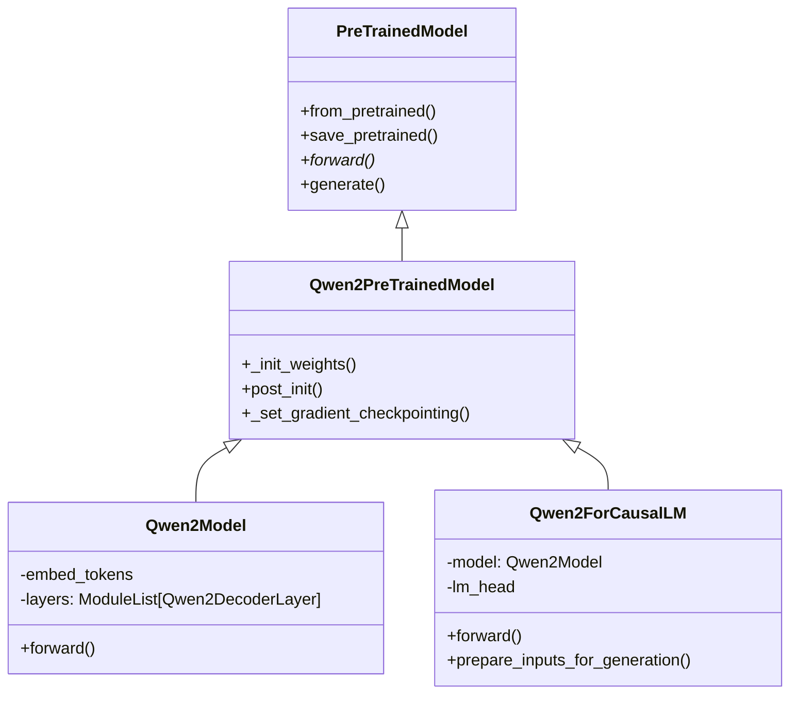
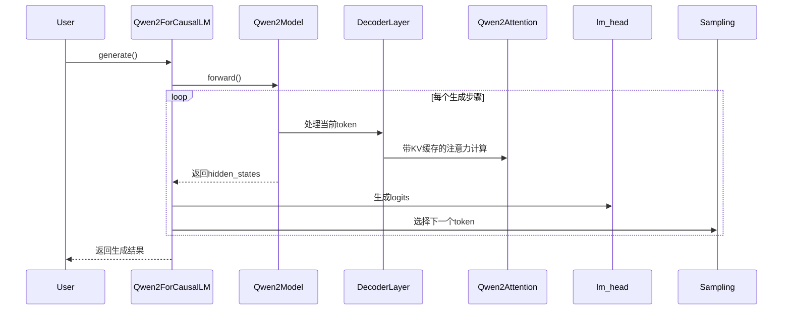

以下是针对推理场景的模型结构定义和forward流程的层次化总结，以及计划用 Go 实现时的设计思路和示例代码。

### 一、类继承体系（Python 版本）


### 二、核心类定义与推理实现（Python 示例）

#### 1. PreTrainedModel（基类）
```python
class PreTrainedModel(nn.Module):
    # 核心推理相关方法
    def generate(
        self,
        inputs: Optional[torch.Tensor] = None,
        generation_config: Optional[GenerationConfig] = None,
        **kwargs,
    ) -> Union[GenerateOutput, torch.LongTensor]:
        # 实现自回归生成逻辑
        # 管理beam search/sampling等策略
        # 处理KV缓存和长度控制
```

#### 2. Qwen2PreTrainedModel
```python
class Qwen2PreTrainedModel(PreTrainedModel):
    def _init_weights(self, module):
        # 初始化策略确保推理数值稳定性
        if isinstance(module, nn.Linear):
            std = self.config.initializer_range
            module.weight.data.normal_(mean=0.0, std=std)
            
    def post_init(self):
        # 注册梯度检查点（训练用）
        # 初始化RoPE位置编码参数
```

#### 3. Qwen2Model（主干网络）
```python
class Qwen2Model(Qwen2PreTrainedModel):
    def forward(
        self,
        input_ids: torch.LongTensor = None,
        attention_mask: Optional[torch.Tensor] = None,
        position_ids: Optional[torch.LongTensor] = None,
        past_key_values: Optional[List[torch.FloatTensor]] = None,
        **kwargs
    ) -> Union[Tuple, BaseModelOutputWithPast]:
        # 推理核心流程
        hidden_states = self.embed_tokens(input_ids)
        
        # 逐层处理（支持KV缓存）
        for idx, decoder_layer in enumerate(self.layers):
            layer_outputs = decoder_layer(
                hidden_states,
                attention_mask=attention_mask,
                position_ids=position_ids,
                past_key_value=past_key_values[idx] if past_key_values else None,
            )
            hidden_states = layer_outputs[0]
            # 更新past_key_values
            
        return BaseModelOutputWithPast(
            last_hidden_state=hidden_states,
            past_key_values=updated_kv_cache,
        )
```

#### 4. Qwen2ForCausalLM（推理入口）
```python
class Qwen2ForCausalLM(Qwen2PreTrainedModel):
    def forward(
        self,
        input_ids: torch.LongTensor = None,
        past_key_values: Optional[List[torch.FloatTensor]] = None,
        **kwargs
    ) -> CausalLMOutputWithPast:
        # 调用主干网络
        outputs = self.model(
            input_ids=input_ids,
            past_key_values=past_key_values,
            **kwargs
        )
        
        # 生成logits
        hidden_states = outputs.last_hidden_state
        logits = self.lm_head(hidden_states)
        
        return CausalLMOutputWithPast(
            logits=logits,
            past_key_values=outputs.past_key_values,
        )

    def prepare_inputs_for_generation(
        self, input_ids, past_key_values=None, **kwargs
    ) -> dict:
        # 生成时优化输入（仅保留最后一个token）
        if past_key_values:
            input_ids = input_ids[:, -1:]
            
        return {
            "input_ids": input_ids,
            "past_key_values": past_key_values,
            "use_cache": kwargs.get("use_cache"),
        }
```

### 三、推理关键组件

#### 1. 注意力层（Qwen2Attention）
```python
class Qwen2Attention(nn.Module):
    def forward(
        self,
        hidden_states: torch.Tensor,
        past_key_value: Optional[Tuple[torch.Tensor]] = None,
    ) -> Tuple[torch.Tensor, Optional[Tuple[torch.Tensor]]]:
        # RoPE位置编码
        query_states, key_states = apply_rotary_pos_emb(
            query_states, key_states, position_ids
        )
        
        # 合并历史KV缓存
        if past_key_value is not None:
            key_states = torch.cat([past_key_value[0], key_states], dim=2)
            value_states = torch.cat([past_key_value[1], value_states], dim=2)
            
        # 计算注意力
        attn_output = torch.matmul(attn_weights, value_states)
        
        return attn_output, (key_states, value_states)
```

#### 2. KV缓存机制
```python
# 缓存数据结构
past_key_values = [
    (layer_key_states, layer_value_states) 
    for each_decoder_layer
]

# 生成时缓存更新
new_cache = []
for idx, layer_output in enumerate(decoder_outputs):
    new_cache.append(layer_output[-1])  # 每个层的(key, value)
```

### 四、推理流程图示


### 五、性能优化设计（Python 版本）
1. **选择性logits计算**：
```python
# 仅计算最后一个token的logits
logits = self.lm_head(hidden_states[:, -1:, :])
```

2. **滑动窗口注意力**：
```python
if self.config.use_sliding_window:
    attention_mask = _create_sliding_window_mask(
        seq_len, 
        self.config.sliding_window
    )
```

3. **Flash Attention集成**：
```python
if config._attn_implementation == "flash_attention_2":
    from flash_attn import flash_attn_func
```

该设计实现了：
- 通过KV缓存减少重复计算
- 利用RoPE实现长上下文建模
- 支持多种注意力优化方案
- 兼容Hugging Face生成工具链
 

### 七、设计考虑与性能优化（Go 版）

1. **KV 缓存**  
   在生成过程中，每一层 Decoder 的 KV 缓存需要高效更新，可设计专门的缓存结构，支持并发读写。

4. **扩展性**  
   借助接口设计，可以方便地集成不同的注意力实现（如 Flash Attention、滑动窗口注意力）以及支持多种生成策略。

### 八、总结

本总结从模型结构、核心类定义、推理实现和性能优化等多个角度介绍了 Transformer 模型，特别是 Qwen2 系列模型在推理过程中的关键组件和流程。  
同时给出了 Python 实现的详细示例，并在此基础上提出了使用 Go 语言实现的设计思路和示例代码，展示了如何利用 Go 的接口和组合特性实现类似的功能，并针对高性能推理场景做了优化设计。

该文档既适用于深入理解 Transformer 模型推理机制，也为基于 Go 的高性能推理实现提供了参考与借鉴。
